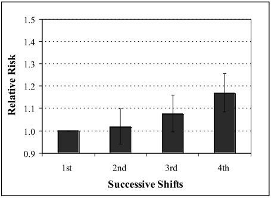
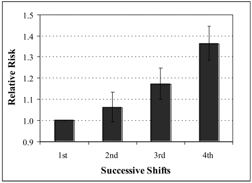

## 連續工作日數

### 修法條文與可能造成的工時樣態

本次勞基法修法草案中，修正勞基法第24條，將休息日加班工資的加給改回核實計算，並修正第勞基法第36條，經目的事業主管機關與勞動部同意，以及經工會同意或無工會者經勞資會議同意後，得鬆綁例假「七休一」原則，最長可連續工作12日。

在拿掉休息日加給加班工資的「以價制量」設計後，雇主會更願意於休息日安排正常工時或延長工時，配合例假「七休一」原則的鬆綁，可合理預期勞工未能正常週休、連續工作日數過長的狀況應該會增加，而下面即是針對這兩種狀況的健康風險進行討論。

### 過勞風險

2009年一篇針對621名芬蘭男性勞工的大型世代研究發現，在追蹤11年後，平均每週工作3日、5日、7日者，其頸動脈內中膜層厚度增加的比率分別為23%、31%、40%，且每週工作天數與頸動脈硬化的惡化程度顯著相關[^15]；而2017年一篇針對39,182名日本男性勞工的大型世代研究，在追蹤7年後，則發現相較於能週休者，未能週休的勞工有顯著較高的風險發生肥胖、血脂異常和代謝症候群[^16]，這顯示勞工未能正常週休和許多慢性病的發生或惡化有密切關係，如肥胖、代謝症候群、血脂異常、血管硬化等促發腦心血管疾病的因子，會增加過勞猝發疾病的發生。

### 工作事故

英國健康與安全執行署在2006年一篇討論輪班工作者疲倦與風險指標的超大型統合研究，分別根據7篇夜班工作與5篇日班工作的文獻，發現隨著連續工作日數增加，夜班和日班工作者出現工作事故的相對風險都會隨之增加，其中連續夜班工作的第四天其相對風險增加36%，而連續日班工作的第四天其相對風險增加17% [^17]。

<figure>
  
  
  <figcaption>上圖取自英國健康與安全執行署〈發展輪班工作者的疲倦與風險指標〉第33及34頁。隨著連續夜班（上方）及日班（下方）的工作日數增加，工作中發生工作事故的相對風險也隨之升高，其中連續夜班工作的第四天其相對風險增加36%；連續日班工作的第四天其相對風險增加17%17。</figcaption>
</figure>

### 肌肉骨骼疾病

除了上述的影響外，肌肉骨骼疾病作為台灣最普遍的職業疾病，也和未能正常週休或連續工作日數過長有關。2006年一篇針對2,617名美國護理師的大型縱貫性研究，發現相較於不須假日上班者，必須假日上班的護理師，發生頸、肩、背部肌肉骨骼疾患的機率是1.4至1.9倍；而連續工作天數超過6天者，肩部肌肉骨骼疾患的機率也是1.4倍[^12]。

### 結論

2010年一篇針對336名英國醫師的橫斷性研究，發現相較於目前已連續工作5日者，因為上個週末值班而目前已連續工作11至12日者，其工作–生活干擾與工作壓力明顯較高[^18]；而2015年一篇針對654名台灣護理師的大型橫斷性研究，發現相較於未曾連續工作7天以上者，過去一個月至少一次連續工作7天以上的護理師，有2.8倍的風險出現付出–回饋失衡（Effort-Reward imbalance，一種工作壓力模型），且其連續工作7天以上的頻率與付出–回饋的失衡，存在劑量效應關係，也就是頻率愈高、失衡狀況愈糟[^19]，這顯示連續工作日數過長對於工作壓力等心理層面也有顯著影響。

上述研究證據顯示，勞工未能正常週休或連續工作日數過長，其負面影響涵蓋勞工的身心健康，不只增加工作壓力，同時也增加過勞和肌肉骨骼疾病的風險，更有可能造成工作中發生傷害或事故。這些負面影響不只危害勞工自身，在與公共安全密切相關的安全敏感產業中，更可能造成社會大眾的危害，尤其今年3月遊覽車司機鄭俊男在連續出勤46天後過勞死，更顯示連續工作天數過長是台灣的嚴重問題，故是否該為特定產業放寬例假「七休一」原則的鬆綁，以及是否該檢討目前已經適用勞基法「變形工時」設計，而得以不受例假「七休一」原則規範的產業，著實應該參酌這些明顯不利的健康風險，審慎予以評估。

-----

[^12]: Trinkoff, A.M., et al., Longitudinal relationship of work hours, mandatory overtime, and on-call to musculoskeletal problems in nurses. Am J Ind Med, 2006. 49（11）: p. 964-71.
[^15]: Niklas Krause, et al., Work Time and 11-Year Progression of Carotid Atherosclerosis in Middle-Aged Finnish Men. Preventing Chronic Disease, 2009. 6: p. 1-20.
[^16]: Itani, O., et al., Short sleep duration, shift work, and actual days taken off work are predictive life-style risk factors for new-onset metabolic syndrome: a seven-year cohort study of 40,000 male workers. Sleep Med, 2017. 39: p. 87-94.
[^17]: The development of a fatigue risk index for shiftworkers, Health and Safety Executive, Editor. 2006.
[^18]: Tucker, P., et al., The impact of junior doctors’ worktime arrangements on their fatigue and well-being. Scandinavian Journal of Work, Environment & Health, 2010. 36（6）: p. 458-465.
[^19]: Pei-Chen Lin, et al., The association between rotating shift work and increased occupational stress in nurses. Journal of Occupational Health, 2015. 57: p. 307-315.
