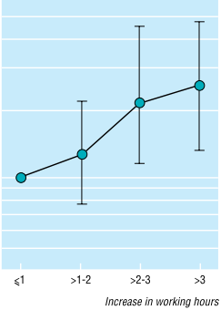

## 密集工作

### 修法條文與可能造成的工時樣態

本次勞基法修法草案中，修正勞基法第36條，經目的事業主管機關與勞動部同意，以及經工會同意或無工會者經勞資會議同意後，得鬆綁例假「七休一」原則，最長可連續工作12日；同時修正勞基法第32條，在工會同意或無工會者經勞資會議同意後，得將單月加班上限由46小時延長到54小時，但三個月總加班工時仍為138小時。由於例假日只是挪移並未消失，且加班仍受三個月138小時的規範，故理論上不會增加勞工的法定總工時上限，即為政府於此次修法中不斷主張的「四個不變」。

然而，伴隨彈性而來的是勞工一定時間內的密集工作，另外如同前述的討論，修正勞基法第24條與第36條，可合理預期會造成勞工未能正常週休、連續工作日數過長的狀況增加，形成一週左右「短期工作過重」的情形；而在容許加班上限於三個月內彈性延長後，雇主可能會因為急單等突發性或季節性人力需求，要求勞工於一定時間內額外延長工作時間，最大程度上，可於六個月內分別安排加班30小時、54小時、54小時、54小時、54小時、30小時，出現最長可於四個月內每月加班54小時，形成第2至5個月「長期工作過重」的狀況。

### 過勞風險

由於長期的工作時間紀錄較難取得，純粹密集工作而非長期工時過長的研究較難進行，但1998年仍有一篇針對526名日本男性勞工的個案對照研究，發現若比較發病前一個月的工作時間，相較於每天平均工作7至9小時者，每天平均工作11小時以上者，有2.94倍急性心肌梗塞的風險；若比較發病前一個月與過往工時最短月份的每日平均工作時間，則發現相較於每日平均工時增加小於1小時者，增加2至3小時與3小時以上者，分別有2.38倍與2.49倍急性心肌梗塞的風險，且工作時間增加愈多，風險就愈大[^20]。

<figure>
  
  <figcaption>上圖取自Shigeru Sokejima〈工作時間作為日本急性心肌梗塞的風險因子：個案對照研究（Working hours as a risk factor for acute myocardial infarction in Japan: case-control study）〉：若比較勞工急性心肌梗塞發病前一個月與過往工時最短月份的每日平均工作時間，工作時間增加愈多，急性心肌梗塞的風險就愈大20。</figcaption>
</figure>

除此之外，2017年一篇針對1,042名韓國申請過勞認定勞工的病例交叉研究，發現個案發病前1週內的週工時，顯著高於發病前1週至3個月內的週工時，且發病前1週內的週工時若增加10小時，腦心血管疾病的風險增加1.45倍。上述結果，對平常週工時小於60小時、50人以下中小企業、輪班工作、22至49歲的壯年勞工影響更為明顯[^21]。

作為世界上工時名列前茅的國家，台灣、日本、韓國有大量關於過勞研究的本土資料。2014年一篇針對966名台灣男性勞工的病例對照研究，發現發病前一週工時60小時以上者，相較於發病前一週工時40小時以下者，冠心病和急性心肌梗塞的校正風險分別高出2.2和2.7倍[^7]；2002年一篇針對705名日本男性勞工的個案對照研究，發現發病前一週的工作時間61小時以上者，相較於發病前一週工時40小時以下者，急性心肌梗塞的校正風險高出1.9倍[^22]；而2013年一篇針對1,117名韓國勞工的個案對照研究，也發現發病前一週的工作時間50至60小時與60小時以上者，相較於發病前一週工時40至50小時者，心血管疾病的就正風險分別高出1.85和4.23倍，而若比較發病前三個月的工作時間，則該週工時48至52小時與52小時以上者相較於40至48小時者，心血管疾病的風險分別高出1.73和3.46倍[^23]。

<table class="table table-bordered table-hover table-condensed">
  <thead>
    <tr>
      <th></th>
      <th>週工時門檻</th>
      <th>過勞風險</th>
      <th>對應勞動狀況</th>
    </tr>
  </thead>
  <tbody>
    <tr>
      <td>2014台灣研究</td>
      <td>單週60小時以上</td>
      <td>2.2倍冠心病 2.7倍急性心肌梗塞</td>
      <td rowspan="3">挪移例休連續工作7天下，7日內額外加班5小時</td>
    </tr>
    <tr>
      <td>2002日本研究</td>
      <td>單週61小時以上</td>
      <td>1.9倍急性心肌梗塞</td>
    </tr>
    <tr>
      <td>2013韓國研究</td>
      <td>單週60小時以上</td>
      <td>4.23倍心血管疾病</td>
    </tr>
    <tr>
      <td>2013韓國研究</td>
      <td>三個月52小時以上</td>
      <td>3.46倍心血管疾病</td>
      <td>連續三個月皆加班54小時</td>
    </tr>
  </tbody>
</table>

統整2002年日本、2014年台灣、2013年韓國的過勞研究結果，並根據其研究結果，列出滿足過勞門檻的對應勞動狀況[^22] [^23] [^7]

根據以上研究結果，以此次行政院版的勞基法修正草案來看，在挪移例假日與休息日後可連續工作7天的情況下（總工時56小時），只需要再額外加班5小時就會超出上述研究中60至61小時週工時的門檻，即有1.9至4.2倍的心血管疾病風險；再者，只要連續三個月每月皆加班54小時，也就是13週內加班162小時，其平均每週工時52.46小時也超過週工時52小時以上的門檻，而有3.46倍心血管疾病的風險。這些滿足過勞門檻的對應勞動狀況，皆屬修法後很可能會發生的非極端案例。

### 工作事故

另外，一篇針對美國1999年至2002年間發生在5座製造業工廠共2,910起工安事故的案例交叉研究，發現工作事故發生前一週員工的工時顯著較高，且前一週工時愈高，接下來發生工作事故的風險就愈高；若一週工時超過66小時，則會有額外88%的風險發生工作事故[^24]。

### 結論

此次勞基法修法主要想回應的對象是有急單等突發性或季節性人力需求的中小企業，但即便這次修法並未增加勞工法定總工時的上限，伴隨彈性而來的卻是可合理預期的「挪移例休連續工作7天下週工時超過60小時」與「連續三個月皆加班54小時」的密集工作狀況。這都已經超過上述研究結果中的過勞門檻，也符合「短期工作過重」與「長期工作過重」的過勞認定標準。

矛盾的是，「短期工作過重」與過勞之間的關係在平常工時短、中小企業、輪班制、22至49歲壯年勞工身上更為明顯，也就是密集工作所造成的過勞問題，衝擊到的正是影響最為顯著的這群勞工；加上聲明有此彈性需求的很多都是有較高工作事故風險的製造業，若再考量密集工作對於工作事故風險的增加，則是否應在既有的勞基法框架中容許這些超限的彈性，進而衍伸更為嚴重的過勞與工作事故風險，絕對是必須審慎思考的嚴肅問題。

-----

[^7]: Cheng, Y., et al., Working hours, sleep duration and the risk of acute coronary heart disease: a case-control study of middle-aged men in Taiwan. Int J Cardiol, 2014. 171（3）: p. 419-22.
[^20]: Shigeru Sokejima and S. Kagamimori, Working hours as a risk factor for acute myocardial infarction in Japan: Case-control study. British Medical Journal, 1998. 317: p. 775-780.
[^21]: Shin, K.S., et al., The effect of long working hours on cerebrovascular and cardiovascular disease; A case-crossover study. Am J Ind Med, 2017. 60（9）: p. 753-761.
[^22]: Y Liu and H. Tanaka, Overtime work, insufficient sleep, and risk of non-fatal acute myocardial infarction in Japanese men. Occup Environ Med, 2002. 59: p. 447-451.
[^23]: Inchul Jeong, et al., Working Hours and Cardiovascular Disease in Korean Workers: A Case-control Study. Journal of Occupational Health, 2013. 55: p. 385-391.
[^24]: Vegso, S., et al., Extended work hours and risk of acute occupational injury: A case-crossover study of workers in manufacturing. Am J Ind Med, 2007. 50（8）: p. 597-603.
